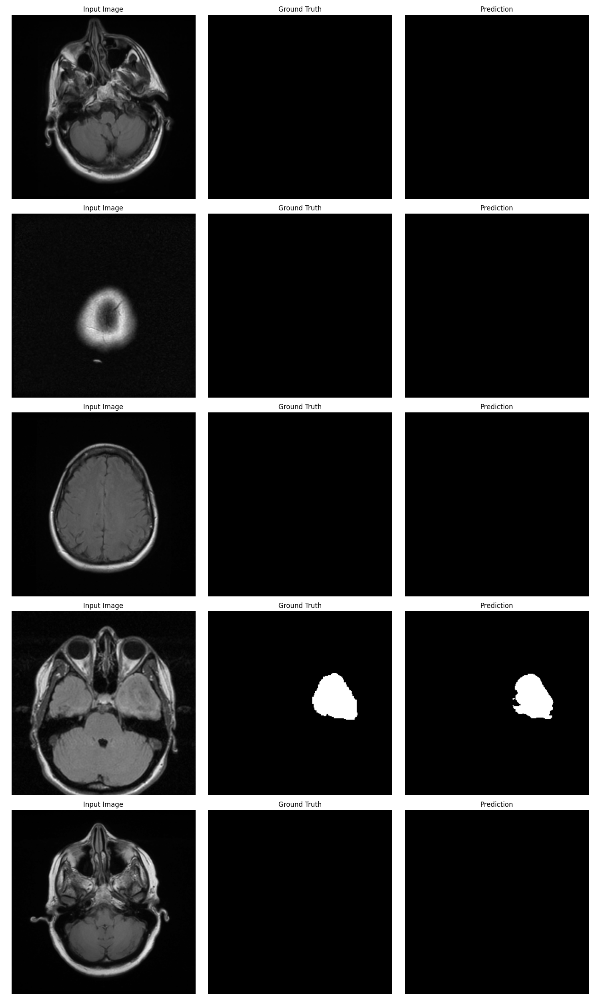

# Agentic AI for Medical Imaging and Diagnosis Support

## Overview

This project implements an advanced AI system for medical image segmentation and diagnosis support, combining deep learning techniques for image analysis with large language models for knowledge retrieval and decision support. The system is designed to assist healthcare professionals in diagnosing medical conditions, particularly focusing on brain tumor segmentation.

## Project Components

### 1. Medical Image Segmentation

- **Model**: Attention Res-UNet architecture with spatial/channel attention gates
- **Dataset**: Kaggle_3m (CT/MRI scans)
- **Preprocessing**: Normalization, augmentation with flips, rotations, patch extraction, and random blur
- **Training**: Hybrid loss function (Dice + BCE), AdamW optimizer
- **Evaluation Metrics**: Dice coefficient, IoU, Hausdorff distance



### 2. Knowledge Distillation

- **Teacher Model**: LLaMA 3.1 8B (frozen for logits/Chain-of-Thought guidance)
- **Student Model**: LLaMA 3.2 3B (fine-tuned and distilled)
- **Dataset**: HPAI-BSC/MMLU-medical-cot-llama31
- **Distillation Process**: Hybrid loss combining cross-entropy with ground truth and KL-divergence with teacher outputs
- **Evaluation Metrics**: Perplexity and METEOR score

### 3. Combined System

- **Integration**: LangGraph + Streamlit for an interactive web interface
- **Components**: Distilled LLaMA model with Attention ResUNet model and RAG
- **Knowledge Base**: Case studies and Graph RAG for contextual retrieval
- **User Interface**: Chat-based interface for querying and image analysis

## Installation

1. Clone the repository:
   ```
   git clone https://github.com/yourusername/medical-imaging-ai.git
   cd medical-imaging-ai
   ```

2. Create and activate a conda environment:
   ```
   conda create -n medical-ai python=3.10
   conda activate medical-ai
   ```

3. Install the required packages:
   ```
   pip install -r requirements.txt
   ```

4. Set up environment variables:
   - Copy `.env.example` to `.env`
   - Add your API keys for HuggingFace and Tavily

5. Download the Kaggle_3m dataset (not included in the repository due to size)

6. Install Ollama for local LLM inference:
   - Follow instructions at [https://ollama.ai](https://ollama.ai)
   - Pull the required model: `ollama pull llama3.1`

## Usage

### Running the Segmentation Model

```python
# Navigate to the Segmentation directory
cd Segmentation

# Run the UNet notebook
jupyter notebook unet1.ipynb
```

### Running the Knowledge Distillation

```python
# Navigate to the Knowledge_Distillation directory
cd Knowledge_Distillation

# Run the knowledge distillation notebook
jupyter notebook knowledge_distillation.ipynb
```

### Running the Chat Interface

```bash
# Run the Streamlit app
streamlit run "Chat With Llama.py"
```

## Results

### Segmentation Performance

- **Train Loss**: 0.0383
- **Validation Loss**: 0.1056
- **Loss Function**: (0.5*BCE) + (0.5*Dice)

### Knowledge Distillation Performance

- **METEOR Score**: 32.74%
- **Perplexity**: 12.89

## Future Work

1. **Expand Dataset Diversity**: Incorporate more diverse medical imaging data for better generalization
2. **Optimize Model Efficiency**: Improve performance for real-time applications
3. **Clinical Validation**: Test the system in real-world clinical settings
4. **Multi-modal Integration**: Enhance the system to handle various types of medical images
5. **Explainable AI**: Improve the interpretability of model decisions for healthcare professionals

## Project Structure

```
.
├── Chat With Llama.py        # Streamlit interface for LLM interaction
├── Docs/                     # Project documentation
│   ├── Project Proposal.pdf
│   └── UNet and Variants for Medical Image Segmentation.pdf
├── Knowledge_Distillation/   # Knowledge distillation implementation
│   ├── kd_baseline.ipynb
│   └── knowledge_distillation.ipynb
├── Segmentation/             # Medical image segmentation implementation
│   ├── training_history.png
│   ├── unet_results.png
│   ├── unet1.ipynb
│   └── kaggle_3m/            # Dataset (not included in repo)
├── .env.example              # Example environment variables
└── .gitignore                # Git ignore file
```

## Technologies Used

- **Deep Learning**: PyTorch, torchvision
- **Image Processing**: OpenCV, NumPy
- **Language Models**: LLaMA 3.1/3.2, Ollama
- **LLM Integration**: LangChain, LangGraph
- **Web Interface**: Streamlit
- **Knowledge Retrieval**: Tavily Search API
- **Evaluation**: NLTK (for METEOR score)

## Author

Pratik Bhangale

---

*This project was developed as part of the IDAI-780 course.*
